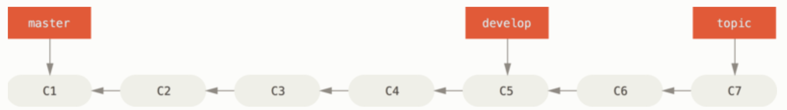
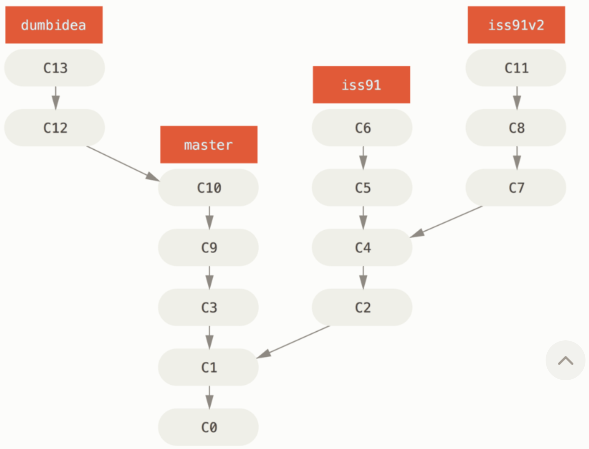

# How to play with GitHub?


## 1. Step by step instructions

> reference link: [msdn](https://docs.microsoft.com/zh-cn/learn/modules/introduction-to-github/)(微软提供的github学习教程 os: 微软啥都教...)

1. init local repo `git init`
2. create github repo
3. push your local repo to github repo `git push`
4. os: 直接看链接吧，不搬轮子了

## 2. Trouble shooting

1. Can't use `git push` from my terminal

> [permission denied](https://docs.github.com/en/authentication/troubleshooting-ssh/error-permission-denied-publickey)
>
> [generate ssh key](https://docs.github.com/en/authentication/connecting-to-github-with-ssh/generating-a-new-ssh-key-and-adding-it-to-the-ssh-agent)
>
> [config ssh to github](https://docs.github.com/en/authentication/connecting-to-github-with-ssh/adding-a-new-ssh-key-to-your-github-account)
>
> os: config ssh and something other... daunt me really...

## 3. Reference

1. [about git](https://docs.github.com/en/get-started/using-git/about-git#basic-git-commands)(github上对git的介绍)
2. [git-reference](https://git-scm.com/docs)(git官网命令行参考手册 os: 我就看了几分钟，啃不动硌牙)
3. [Pro Git](https://git-scm.com/book/en/v2)(很详细的官方推荐书籍，只用看前几章就可以了 os: 这个倒可以花时间认真看看，写得不错)

## git个人学习笔记

因为git版本更新具有backward compatibility，所以很多指令的功能有所重叠，建议选择最直观常用的指令记忆

### 1. 针对repo开发的常规指令

```command line
git add
git commit [-m] [-a]
git diff [--staged]
git status [--short]
git rm [-f] [--cache](--cache指明从staged area删除该文件但不从working directory删除文件)
git mv (用来对文件进行重命名)
```

### 2. 针对repo配置的指令

```command line
git init
git clone
git config
git push
```

### 3. 显示repo开发时记录(log)

```command line
git log [--patch] [--stat] 
[--pretty=oneline(short/full/fuller/format:"%h - %an, %ar : %s")] 
[--graph] [-<n>](e.g. -2) [--since=2.weeks] [--until=] [--auther] [--grep] 
[-S <string>] (pickax option, 用来显示指定字符串次数改变的commit os: 建议通过实例理解) 
[-- <path>] (重要，用于显示路径文件或文件夹更改过的commit)

e.g. (os: 经典叠buff)
For example, if you want to see which commits modifying test files in the Git source code history were committed by Junio Hamano in the month of October 2008 and are not merge commits, you can run something like this:
git log --pretty="%h - %s" --author='Junio C Hamano' --since="2008-10-01" \
   --before="2008-11-01" --no-merges -- t/
```

### 4. 进行repo操作回退

```command line
git commit [--amend] (对上次commit进行修补工作)
git restore(对working directory进行恢复) [--staged](对staged area进行恢复)
```

### 5. 远程repo协作(remote)

```command line
git remote [-v] (显示URLs)
git remote add <shortname> <url>
git fetch <remote>
git pull (在fetch基础上进行merge, 如果pull.febase变量没有设定则会给出警告)
git config --global pull.rebase "true" (pulling时进行rebase)
git push <remote> <branch> (如果和别人同时clone后而别人先push的话你再push就会被reject, 你需要fetch后incorporate别人代码后再push)

git remote show <remote>
git remote rename <remote> <new_remote>
git remote remove <remote>
```

### 6. git tricks

`git config --global alias.<alias> <command>`

(e.g. git config --global alias.st status, you can type ` git last ` instead ` git 'git log -1 HEAD' `)

`git config -global credential.helper cache`

(using HTTPS URL to push and don't wanna to type password everytime, see more in [credential storage](https://git-scm.com/book/en/v2/Git-Tools-Credential-Storage#_credential_caching))

### 7. git branch management

#### branching model

```command line
git branch <branch> (create a new branch)
git branch -d <branch> (delete a branch)

git checkout <branch> (switch to a new branch)
git checkout -b <branch> (create and switch to a new branch)

git log --oneline --decorate --graph --all (paint a tree with all branches. os: cool!!!)

git switch [-c/--create]  <branch>
git swtich - (switch to previous branch)

git merge <branch> (e.g. git check out master | git merge hotfix)
git merge --abort (abort the merge)
git mergetool (graphical tool to resolve issues)
```

#### useful command

```command line
git branch [-v] (list all exiting branches) [-all] (including remote branches)
git branch [--merged/--no_merged]
git branch --move <old_branch_name> <new_branch_name> (change the name of branch)
git push --set-upstream origin <new_branch_name> (push new/rename branch to remote)
git push <origin> --delete <branch>
```

#### branching workflow

1. Longing-Running Branches (A long commits with multiple branches in different stages)

2. Topic Branches


#### remote branches

branches name like `origin/main`

```command line
git fetch <remote> (get remote database without omit)
git push <remote> <branch>:<branch_newname>(':'以及后面部分可省略)
git merge <remote/branch> (merge remote work to current working branch)
git checkout -b <branch> <remote/branch> (create a new branch that you can work on)
```
